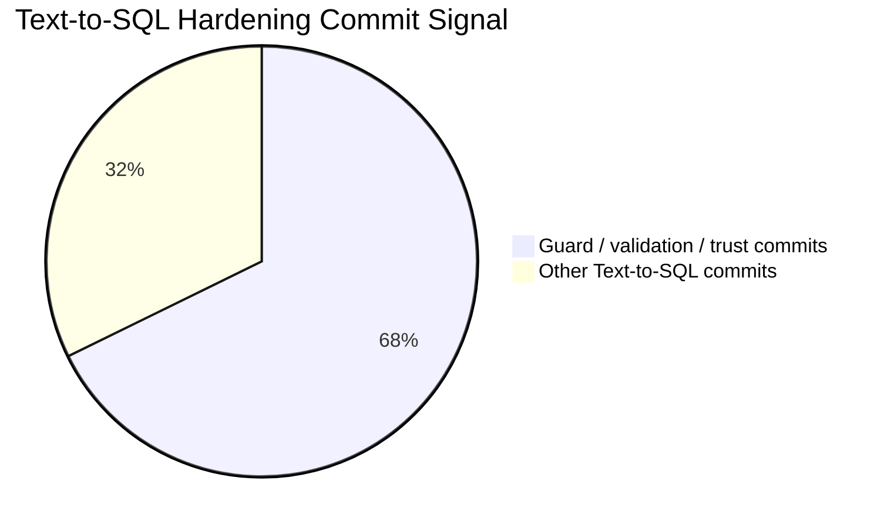
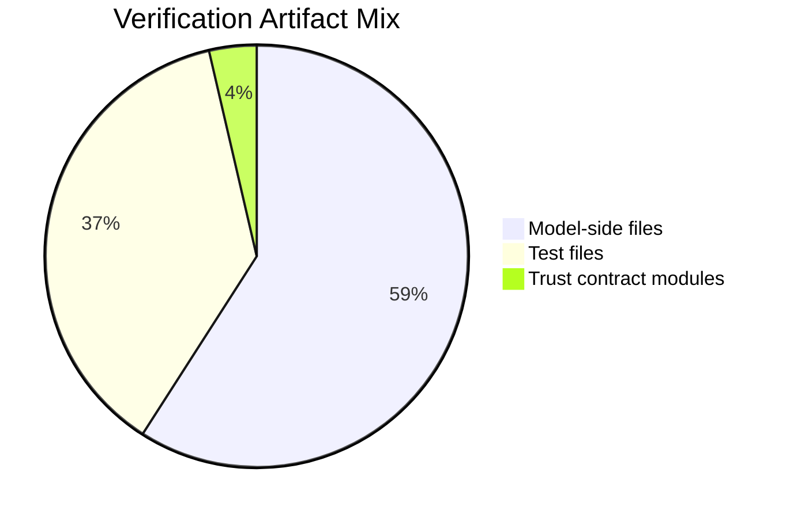

# Search-Pro: Schema-Grounded Text-to-SQL Assistant

## One-line Summary

A Text-to-SQL assistant that translates natural language questions into SQL queries and highlights practical challenges in schema grounding, query validation, failure analysis, and human-verifiable AI outputs.

## Public Snapshot Scope

This repository is a sanitized portfolio snapshot. It preserves the research framing, mock schema, example queries, failure taxonomy, and a small mock reference pipeline in `src/SearchProPublic`.

The full local application was not copied into this public snapshot because several production files contain internal database names, schema identifiers, uploaded files, and evaluation artifacts. Those files should stay private.

## Portfolio Framing

**Positioning:** Backend Engineer -> XAI / Agent Explainability / Text-to-SQL Evaluation Researcher-in-Progress

Search-Pro is framed here as an engineering case study: how a production-style backend experience can become a concrete research question about explainability, evaluation, and trust in Text-to-SQL systems.

The core lesson is that Text-to-SQL is not only about generating a syntactically correct query. A useful system also has to make the generated query understandable, verifiable, and debuggable by humans.

## Why This Project Matters

Text-to-SQL systems can fail in ways that are hard to see from the final table alone:

- How can a human trust SQL generated from a natural language question?
- What failures appear when a query is generated without strong schema grounding?
- How should Text-to-SQL be evaluated beyond exact-match accuracy?
- Can validation, execution feedback, and explanation traces make generated queries easier to debug?

This project explores those questions through a backend pipeline that routes a user question, grounds it in a schema catalog, asks an LLM for a structured semantic plan, renders SQL server-side, validates read-only constraints, executes a query, and returns result metadata for human review.

## Engineering Evidence

This repository does not claim private production accuracy. Instead, it shows how a Text-to-SQL system was hardened through schema grounding, guarded SQL generation, validation layers, result contracts, and regression-oriented failure analysis.

Quantitative evidence below comes from a sanitized audit of the private development history before this public snapshot was created. The original history and internal data are not included in this repository.

| Evidence | Count |
| --- | ---: |
| Text-to-SQL related commits reviewed | 124 |
| Guard / validation / trust related commits reviewed | 84 |
| Text-to-SQL model-side files reviewed | 114 |
| Text-to-SQL related test files reviewed | 72 |
| Trust contract modules reviewed | 7 |
| Sensitive keyword hits in this public snapshot | 0 |
| Forbidden tracked files in this public snapshot | 0 |





See [docs/engineering-evidence.md](docs/engineering-evidence.md) for the guardrail comparison and failure coverage matrix.

## System Flow

1. User question
2. Schema/context retrieval
3. Prompt construction
4. SQL generation via server-rendered semantic plan
5. SQL validation/safety check
6. Query execution
7. Result formatting
8. Human verification / feedback

In the analyzed local implementation, the LLM is constrained to produce a structured semantic plan. Direct model-authored SQL responses are blocked, and SQL is rendered inside the application from schema-grounded plan objects.

## Key Features

These features were verified in the original local source before sanitization. The public snapshot keeps only safe documentation and mock reference code.

- ASP.NET Core MVC backend for a natural-language query lab.
- Authenticated query endpoint that receives screen/type context, user question, prior conversation id, attachments, and template-assist metadata.
- Schema-aware prompt builder that injects schema catalog context, value catalogs, few-shot examples, conversation history, and attachment context.
- LLM client with structured JSON response schema for semantic plans.
- Model response parser that accepts `plan` or `clarify` and blocks direct `sql` responses.
- Server-side semantic SQL renderer that converts a validated semantic plan into SQL.
- SQL validation layer that restricts execution to read-only `SELECT` / `WITH ... SELECT` patterns, rejects forbidden tokens, checks allowed objects, and applies row limits.
- Query execution service with shape preflight and formatted result rows.
- Clarification path for ambiguous or unsupported questions.
- Result trace and trust contract fields that expose route status, route source, validation code, result contract code, selected shape, allowed execution level, axes, filters, and a safe trace.
- SQL viewing is gated by a session-backed unlock flow, instead of being exposed by default.
- Failure collection, saved conversation review, golden draft generation, and regression-oriented test assets exist for development and evaluation workflows.

## Research Connection

This project connects backend engineering work to the following research questions:

- How can Text-to-SQL systems expose enough reasoning trace for human verification?
- What SQL generation failures appear in schema-grounded enterprise DBs?
- Can validation, execution feedback, and explanation traces improve trust?
- How should Text-to-SQL be evaluated beyond exact-match accuracy?

The interesting research direction is not only whether a query returns the right answer, but whether the system can explain why it chose a source, which fields it used, what constraints were applied, why a query was rejected, and how a human can inspect the result safely.

## Failure Analysis

Failure modes are documented with a public-safe mock schema in [docs/failure-analysis.md](docs/failure-analysis.md).

Covered categories:

- wrong table
- wrong column
- invalid join
- aggregation error
- hallucinated schema
- unsafe query
- ambiguous question
- correct SQL but misleading result

## Example Queries

Public-safe example queries are listed in [docs/example-queries.md](docs/example-queries.md). They use only the mock schema from [docs/mock-schema.sql](docs/mock-schema.sql).

## Sanitized Reference Code

The public code sample in [src/SearchProPublic](src/SearchProPublic) demonstrates the trust boundary without internal data:

- mock schema catalog
- prompt preview construction
- simple semantic planner
- server-side SQL renderer
- read-only SQL validator
- mock execution response
- trace output for human verification

Run it locally with:

```powershell
dotnet run --project src/SearchProPublic/SearchProPublic.csproj -- "Show observation counts by age band and topic"
```

## Public Data and Security Notes

This repository should be published only as a sanitized portfolio snapshot.

Do not publish:

- real company database names, hosts, connection strings, credentials, or internal network addresses
- provider tokens or SQL-view unlock tokens
- private entity, employee, or personally identifying data
- production uploaded files, email exports, spreadsheets, logs, or debug artifacts
- real table names, real column names, or proprietary schema mappings

Use `.env.example`, `appsettings.example.json`, and `docs/mock-schema.sql` for public configuration and examples. Any local `appsettings*.json` file must be scrubbed or replaced with placeholders before GitHub publication.

## Planned

These are intentionally listed as planned work, not current functionality:

- A public demo mode backed only by the mock schema.
- A human-readable query explanation panel that maps natural language phrases to schema fields.
- A formal evaluation dashboard comparing exact match, execution accuracy, safety rejection, trace quality, and debuggability.
- A reproducible benchmark package that can run without internal data.

## ICML 2026 Conversation Angle

> I built a Text-to-SQL style assistant where natural language questions are converted into SQL and executed against a database. What interested me was not only generation accuracy, but how humans can verify, debug, and trust the generated query. I am now connecting this engineering experience to explainability, schema grounding, and evaluation.

## Documentation Map

- [docs/research-notes.md](docs/research-notes.md): research framing and evaluation ideas
- [docs/engineering-evidence.md](docs/engineering-evidence.md): quantitative evidence, guardrail comparison, and failure coverage
- [docs/failure-analysis.md](docs/failure-analysis.md): failure taxonomy using mock schema
- [docs/example-queries.md](docs/example-queries.md): public-safe query examples
- [docs/mock-schema.sql](docs/mock-schema.sql): mock schema and dummy data
- [.env.example](.env.example): placeholder environment configuration
- [appsettings.example.json](appsettings.example.json): placeholder JSON configuration
- [src/SearchProPublic](src/SearchProPublic): mock reference pipeline
