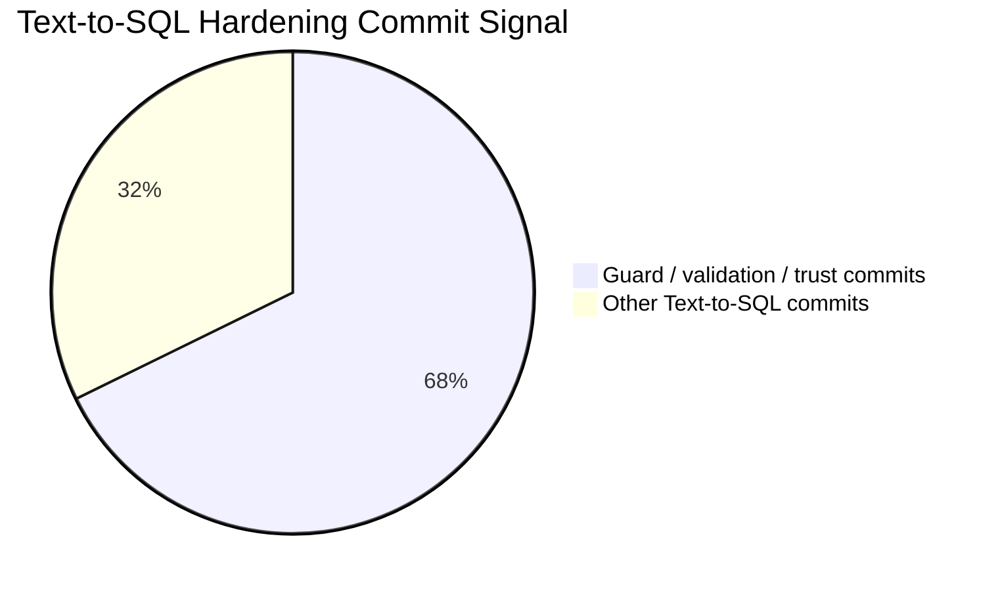
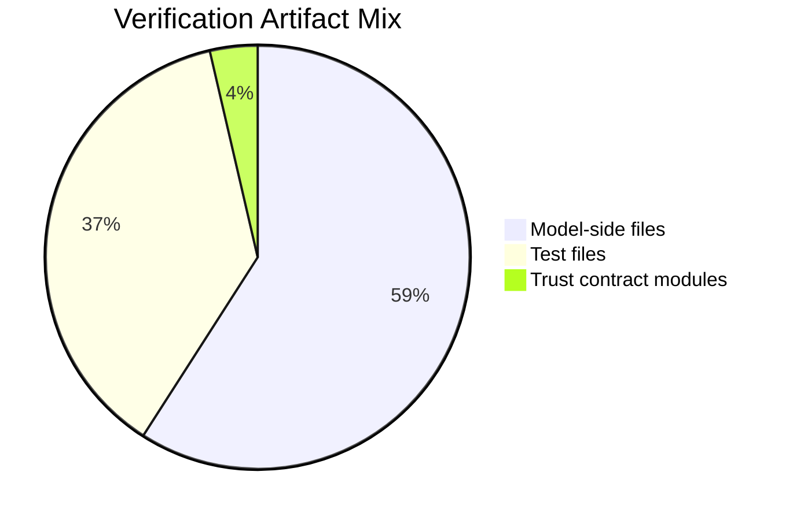

# Hwang Junsoo / 황준수

Backend Engineer -> XAI / Agent Explainability / Text-to-SQL Evaluation Researcher-in-Progress

I build backend systems and study how AI-generated outputs can be verified, debugged, and trusted by humans.

## Profile

| Photo | Profile |
| --- | --- |
| Add `assets/profile.jpg` here when ready. | **Name:** Hwang Junsoo / 황준수<br>**Role:** Backend Engineer, AI Reliability Researcher-in-Progress<br>**Focus:** Text-to-SQL, schema grounding, explainability, evaluation<br>**GitHub:** [dingmon1019](https://github.com/dingmon1019)<br>**Email:** Add public email here<br>**Phone:** Add only in private/PDF resume version<br>**Location:** South Korea |

## At a Glance

| Category | Summary |
| --- | --- |
| Engineering base | Backend systems, database workflows, query endpoints, authentication-aware service logic |
| AI system focus | Text-to-SQL, schema grounding, validation, failure analysis, human-verifiable traces |
| Representative project | [Search-Pro: Schema-Grounded Text-to-SQL Assistant](https://github.com/dingmon1019/Search-Pro-Text-to-SQL) |
| Evidence style | Guardrails, result contracts, failure taxonomies, regression-oriented evaluation |
| Current direction | XAI / Agent Explainability / Text-to-SQL Evaluation |

## My Trajectory

| Stage | Direction | What I Worked On | What It Taught Me |
| --- | --- | --- | --- |
| Backend engineering | Production-style service logic | APIs, databases, authentication-aware flows, file/data workflows, admin/user screens | Reliable software needs clear boundaries, validation, and observable failure modes. |
| AI-assisted backend systems | Natural language interfaces over data | Text-to-SQL pipeline, schema context, prompt construction, generated-query execution | Generated answers are not enough. Users need to inspect why an answer was produced. |
| Researcher-in-progress | Explainability and evaluation | Schema grounding, direct SQL blocking, safety validation, result contracts, failure analysis | Text-to-SQL should be evaluated as a trust and debugging problem, not only as exact-match SQL. |

## How I Work

| Principle | What It Means In Practice |
| --- | --- |
| Trust is engineered | I do not treat LLM output as automatically reliable. I add validation layers around it. |
| Intermediate states matter | I prefer systems that expose plans, selected fields, validation results, and trace metadata. |
| Bugs become test material | Repeated failures should become regression cases, not just one-off fixes. |
| Public work should be safe | I separate public mock artifacts from private data, internal schemas, uploaded files, and local history. |
| Backend work can become research | Practical failures can be reframed as evaluation questions for AI systems. |

## Skills Matrix

| Area | Tools / Concepts | How I Use Them |
| --- | --- | --- |
| Backend | C#, ASP.NET Core MVC, service layers, controller workflows | Build query endpoints, business workflows, and authenticated service logic. |
| Database | SQL Server, schema catalogs, SQL validation, query execution | Ground generated queries in known objects and validate execution boundaries. |
| AI systems | LLM prompting, structured outputs, Text-to-SQL, semantic planning | Convert user questions into inspectable intermediate plans before SQL execution. |
| Evaluation | Regression tests, failure taxonomy, golden-case review, result contracts | Turn failures into measurable cases and compare behavior across guardrails. |
| Security and privacy | Sanitized snapshots, mock schema, placeholder config, tracked-file checks | Publish portfolio evidence without exposing private data or local configuration. |

## Representative Work

| Project | Problem | What I Built | Evidence | Link |
| --- | --- | --- | --- | --- |
| Search-Pro: Schema-Grounded Text-to-SQL Assistant | Generated SQL can be syntactically valid but hard for humans to trust, verify, or debug. | A Text-to-SQL trust pipeline using semantic plans, server-side SQL rendering, read-only validation, result contracts, failure analysis, and public-safe mock documentation. | 124 Text-to-SQL related commits reviewed, 84 guard/validation/trust related commits reviewed, 72 related test files reviewed, public snapshot scan hits 0. | [GitHub repo](https://github.com/dingmon1019/Search-Pro-Text-to-SQL) |

## Search-Pro Case Study

Search-Pro started as a backend Text-to-SQL assistant: a user asks a natural-language question, the system builds schema/context, prompts an LLM, generates SQL, executes a database query, and returns results.

The more interesting problem became trust:

| Question | Why It Matters |
| --- | --- |
| Can a human verify generated SQL before trusting the result? | A query can run successfully and still answer the wrong question. |
| What happens when a model guesses a table or column? | Schema hallucination can create plausible but invalid answers. |
| How should unsafe or ambiguous requests be handled? | A trustworthy assistant should reject, clarify, or expose uncertainty. |
| What should evaluation measure beyond exact match? | Production failures involve safety, ambiguity, debuggability, and trace quality. |

### System Flow

1. User question
2. Schema/context retrieval
3. Prompt construction
4. Semantic plan generation
5. Server-side SQL rendering
6. SQL validation/safety check
7. Query execution
8. Result formatting
9. Human verification / feedback

### Guardrail Layer Comparison

| Layer | Direct LLM-to-SQL baseline | Search-Pro guarded flow |
| --- | --- | --- |
| Model output | SQL text | Semantic plan or clarification |
| Schema control | Mostly prompt-dependent | Known source and field validation |
| SQL generation | Model-generated | Server-side renderer |
| SQL safety | Manual review or shallow checks | Read-only validation gate |
| Execution readiness | Try and fail | Preflight metadata check |
| Result correctness | Final table only | Result contract validation |
| Human verification | Hard to inspect | Trust trace and result metadata |
| Failure handling | One-off debugging | Regression and harness loop |

## Engineering Evidence

This repository does not claim private production accuracy. Instead, it shows how a Text-to-SQL system was hardened through schema grounding, guarded SQL generation, validation layers, result contracts, and regression-oriented failure analysis.

Quantitative evidence below comes from a sanitized audit of private development history before this public snapshot was created. The original history and internal data are not included in this repository.

| Evidence | Count |
| --- | ---: |
| Text-to-SQL related commits reviewed | 124 |
| Guard / validation / trust related commits reviewed | 84 |
| Text-to-SQL model-side files reviewed | 114 |
| Text-to-SQL related test files reviewed | 72 |
| Trust contract modules reviewed | 7 |
| Sensitive keyword hits in this public snapshot | 0 |
| Forbidden tracked files in this public snapshot | 0 |





## Research Direction

| Question | Current Framing |
| --- | --- |
| How can humans verify AI-generated SQL? | Expose semantic plans, selected fields, validation results, and result traces. |
| How should Text-to-SQL be evaluated beyond exact match? | Measure schema grounding, safety rejection, execution validity, result shape, trace quality, and debuggability. |
| Can validation and execution feedback improve trust? | Use safety gates, preflight checks, and result contracts to surface failures before users over-trust outputs. |
| What traces should agentic query systems expose? | Show enough intermediate state for a human to confirm route, filters, axes, measures, and rejection reasons. |

## Evidence & Artifacts

| Artifact | Purpose |
| --- | --- |
| [docs/engineering-evidence.md](docs/engineering-evidence.md) | Quantitative evidence, guardrail comparison, and failure coverage matrix |
| [docs/research-notes.md](docs/research-notes.md) | Research framing and evaluation ideas |
| [docs/failure-analysis.md](docs/failure-analysis.md) | Failure taxonomy using public-safe mock schema |
| [docs/example-queries.md](docs/example-queries.md) | Public-safe Text-to-SQL examples |
| [docs/mock-schema.sql](docs/mock-schema.sql) | Mock schema and dummy data |
| [src/SearchProPublic](src/SearchProPublic) | Minimal public reference pipeline |
| [.env.example](.env.example) | Placeholder environment configuration |
| [appsettings.example.json](appsettings.example.json) | Placeholder JSON configuration |

## Public Snapshot Scope

This repository is a sanitized portfolio snapshot. It preserves the research framing, mock schema, example queries, failure taxonomy, and a small mock reference pipeline in `src/SearchProPublic`.

The full local application was not copied into this public snapshot because private production files can contain internal database names, schema identifiers, uploaded files, and evaluation artifacts. Those files should stay private.

Do not publish:

- real company database names, hosts, connection strings, credentials, or internal network addresses
- provider tokens or SQL-view unlock tokens
- private entity, employee, or personally identifying data
- production uploaded files, email exports, spreadsheets, logs, or debug artifacts
- real table names, real column names, or proprietary schema mappings

## Local Mock Demo

The public code sample demonstrates the trust boundary without internal data:

```powershell
dotnet run --project src/SearchProPublic/SearchProPublic.csproj -- "Show observation counts by age band and topic"
```

## ICML 2026 Conversation Angle

> I built a Text-to-SQL style assistant where natural language questions are converted into SQL and executed against a database. What interested me was not only generation accuracy, but how humans can verify, debug, and trust the generated query. I am now connecting this engineering experience to explainability, schema grounding, and evaluation.

## Contact

| Channel | Link |
| --- | --- |
| GitHub | [https://github.com/dingmon1019](https://github.com/dingmon1019) |
| Portfolio project | [Search-Pro Text-to-SQL](https://github.com/dingmon1019/Search-Pro-Text-to-SQL) |
| Email | Add public email here |
