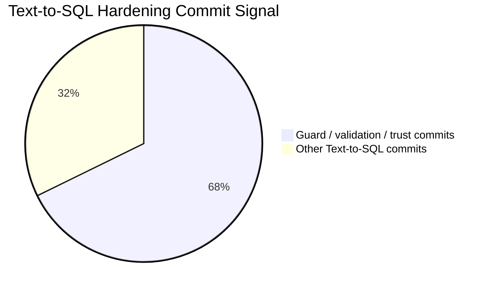
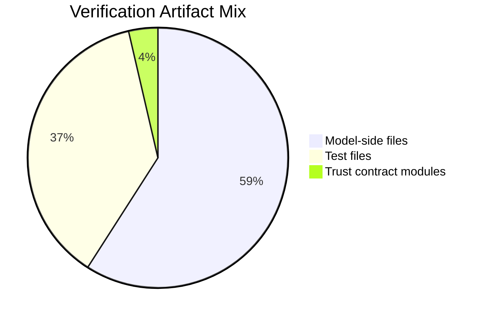

# Engineering Evidence

This page explains how Search-Pro is presented as a Text-to-SQL trust and evaluation project rather than a raw generation demo.

The numbers below come from a sanitized audit of the private development history before the public snapshot was created. They are included to show engineering direction and review effort, not to claim benchmark accuracy on private data.

## Quantitative Snapshot

| Evidence | Count |
| --- | ---: |
| Text-to-SQL related commits reviewed | 124 |
| Guard / validation / trust related commits reviewed | 84 |
| Text-to-SQL model-side files reviewed | 114 |
| Text-to-SQL related test files reviewed | 72 |
| Trust contract modules reviewed | 7 |
| Sensitive keyword hits in this public snapshot | 0 |
| Forbidden tracked files in this public snapshot | 0 |

## Guardrail Layer Comparison

| Layer | Direct LLM-to-SQL baseline | Search-Pro guarded flow |
| --- | --- | --- |
| Model output | SQL text | Semantic plan or clarification |
| Schema control | Mostly prompt-dependent | Known source and field validation |
| SQL generation | Model-generated | Server-side renderer |
| SQL safety | Manual review or shallow checks | Read-only validation gate |
| Execution readiness | Try and fail | Preflight metadata check |
| Result correctness | Final table only | Result contract validation |
| Human verification | Hard to inspect | Trust trace and result metadata |
| Failure handling | One-off debugging | Regression and harness loop |

## Failure Coverage Matrix

| Failure mode | Detection or mitigation | Evidence type |
| --- | --- | --- |
| Wrong table/source | Source routing and object policy | Guardrail |
| Wrong column | Semantic field validation | Guardrail |
| Invalid join | Server-owned rendering rules and preflight metadata checks | Guardrail |
| Aggregation error | Metric intent and result contract validation | Evaluation |
| Hallucinated schema | Known-field constraints and schema validation | Guardrail |
| Unsafe query | Read-only SQL validation | Safety |
| Ambiguous question | Clarification flow | UX / safety |
| Correct SQL but misleading result | Filter/value resolution and result trace review | Failure analysis |
| Silent zero-row | Filter resolution hardening and regression cases | Failure analysis |
| Multi-turn contamination | Conversation-state validation and prompt-boundary checks | Regression |

## Evidence Charts

## Portfolio Interpretation

The strongest claim is not "the model gets every query right." The stronger, safer claim is:

> Search-Pro treats Text-to-SQL as a trust pipeline: the model proposes a structured plan, the backend validates it against known schema, the application renders SQL, safety gates check execution eligibility, result contracts verify output shape, and trace metadata helps a human review what happened.

That framing is useful for XAI, agent explainability, and Text-to-SQL evaluation because it turns backend failure handling into a measurable research question.
